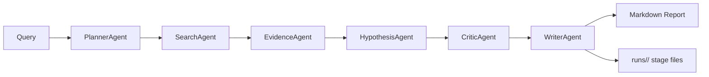

# AutoGen ECM Organoid Assistant

## 30 秒简介

这是一个面向 ECM 与类器官研究的研究型工作台，主线不是聊天，而是：

- literature-guided candidate generation
- controlled FEBio-backed simulation
- structured decision reporting

它把文献线索、力学拟合、候选设计、固定场景 FEBio 验证、报告和 `runs/` 工件放进同一个可复盘 workspace。

## 核心闭环流程

```text
literature / priors
-> mechanics-informed candidate generation
-> controlled simulation request
-> template-driven FEBio execution
-> structured metrics + final recommendation
```

## 最小 CLI 示例

```bash
python -m ecm_organoid_agent \
  --workflow simulation \
  --query "Bulk verify ECM candidate with FEBio" \
  --simulation-scenario bulk_mechanics \
  --target-stiffness 8 \
  --matrix-youngs-modulus 8 \
  --matrix-poisson-ratio 0.3 \
  --report-name febio_simulation_report.md
```

## design + simulation 示例

```bash
python -m ecm_organoid_agent \
  --workflow design \
  --query "Design a GelMA-like ECM near stiffness 8 Pa with FEBio verification" \
  --target-stiffness 8 \
  --target-anisotropy 0.1 \
  --target-connectivity 0.95 \
  --target-stress-propagation 0.5 \
  --design-run-simulation \
  --design-simulation-scenario bulk_mechanics \
  --design-simulation-top-k 2 \
  --report-name design_with_febio_report.md
```

## 边界说明

- 当前 FEBio integration 只支持 3 个固定场景：`bulk_mechanics`、`single_cell_contraction`、`organoid_spheroid`
- 这不是通用任意 FE 建模平台
- 这不是自动 wet-lab protocol generator
- 这是 phase-1 research prototype，结果仍需人工判断和实验验证

一个面向 ECM 与类器官研究的研究型智能体工作台。

当前仓库包含 4 类能力：

1. 文献型智能体：围绕 ECM / hydrogel / organoid 问题做多智能体协作式综述与周报生成
2. 力学与设计引擎：围绕 creep / relaxation / elastic / frequency sweep / cyclic 数据做建模、反推和候选设计
3. FEBio-backed simulation：用固定模板 + 参数注入 + schema 校验运行 3 类受限 FEBio 场景，并返回结构化 JSON 指标
4. 研究工作台：把运行过程、阶段产物、报告、数据集、Demo 和本地资料统一收纳在一个可复盘的 workspace 中

## 目录

- [30 秒简介](#30-秒简介)
- [核心闭环流程](#核心闭环流程)
- [最小 CLI 示例](#最小-cli-示例)
- [design + simulation 示例](#design--simulation-示例)
- [边界说明](#边界说明)
- [这个项目解决什么问题](#这个项目解决什么问题)
- [核心能力总览](#核心能力总览)
- [多智能体如何协作](#多智能体如何协作)
- [支持哪些 workflow](#支持哪些-workflow)
- [仓库内容一览](#仓库内容一览)
- [安装与快速开始](#安装与快速开始)
- [配置说明](#配置说明)
- [CLI 运行方式](#cli-运行方式)
- [前端与桌面运行](#前端与桌面运行)
- [本地文献库与研究记忆](#本地文献库与研究记忆)
- [输出、工件与复盘](#输出工件与复盘)
- [数据集、校准与设计链路](#数据集校准与设计链路)
- [Full Demo 演示链路](#full-demo-演示链路)
- [测试与开发](#测试与开发)
- [适用边界与注意事项](#适用边界与注意事项)

## 这个项目解决什么问题

ECM 与类器官研究通常会同时碰到几类任务：

- 需要快速梳理某个方向的最新文献、关键证据和材料路线
- 需要把本地 PDF、笔记和外部数据库结果放在一起比较
- 需要从力学实验数据中提取更有解释力的参数，而不是只看一个刚度数字
- 需要把“目标力学性质”翻译成候选 ECM 配方家族与实验起点
- 需要把每次分析过程保留下来，方便复盘、汇报和迭代

这个项目把这些任务放进同一个 workspace 中处理。你可以把它理解为一个面向 ECM 研究的“研究操作系统”：

- 用 AutoGen 处理文献协作和报告写作
- 用确定性的 mechanics / fiber-network backend 处理建模、仿真与设计
- 用受约束的 FEBio integration layer 处理固定场景的 FE 验证，而不是让 agent 自由生成任意 XML
- 用 `memory/`、`library/`、`reports/`、`runs/` 组织你的个人研究知识库

## 核心能力总览

### 1. 文献研究智能体

- 检索 PubMed
- 检索 Crossref，补 DOI、期刊元数据和较新的记录
- 检索本地 `library/` 中的 PDF、Markdown、txt 资料
- 将结果拆分为证据、推断、假设和下一步实验
- 自动按模板输出中文 Markdown 报告
- 自动记录阶段性产物，方便复查每一步是怎么得出结论的

### 2. 力学建模与数据分析

- 支持 `elastic`
- 支持 `creep`
- 支持 `relaxation`
- 支持 `frequency_sweep`
- 支持 `cyclic`
- 自动比较多个候选 constitutive family，而不是强行套一个固定模型
- 输出 `selected_model`、`candidate_models`、`parameter_intervals`、`identifiability`

### 3. ECM inverse design

- 支持按目标 stiffness 做候选 ECM 参数搜索
- 支持约束 anisotropy、connectivity、stress propagation、risk index
- 支持额外 target / constraint JSON
- 支持多目标窗口 campaign，对比一个材料家族是否能覆盖多个 stiffness 区间
- 支持把抽象参数映射成更接近 wet-lab 的 formulation suggestion

### 4. Hybrid literature + mechanics + simulation

- 先用文献 workflow 形成材料与机制判断
- 再对样本实验数据做 mechanics fitting
- 再运行 fiber-network simulation 和参数扫描
- 最终给出一个更接近“研究决策”的综合报告

### 5. FEBio-backed simulation

- 当前第一阶段只支持 3 个固定场景：
  - `bulk_mechanics`
  - `single_cell_contraction`
  - `organoid_spheroid`
- 使用固定模板 + 参数注入 + schema 校验生成 `input.feb`
- 输出 `simulation_result.json`、`simulation_metrics.json` 和 Markdown summary
- 支持接入 `design` workflow，对 top-k 候选做可选仿真复核
- 若本机未安装 FEBio，会优雅降级并明确标记“未进行仿真验证”

### 6. 数据集与校准

- 维护 curated public hydrogel dataset 清单
- 支持把本地下载的 archive 自动注册进 `datasets/`
- 支持标准化已有数据目录
- 支持把实验数据转换成 calibration prior，用于后续设计 workflow

### 7. 研究工作台与前端

- Dashboard：总体状态和最近结果
- Design Board：设计候选与 formulation mapping 可视化
- Simulation：固定场景 FEBio 运行、指标查看与工件浏览
- Agent Console：查看运行日志和结构化 payload
- Research Run：发起各类 workflow
- Demo：一键跑完整演示链路
- Reports：浏览历史报告
- Library：查看本地文献库状态
- Guide：前端操作说明
- Settings：查看当前运行时配置

## 多智能体如何协作

默认的文献协作 workflow 是一个显式分工的多智能体流程，而不是“一个模型假装很多角色”。



### 角色分工

- `PlannerAgent`
  - 拆解研究问题
  - 定义子问题、搜索优先级、抽取字段和停止条件
- `SearchAgent`
  - 调 `search_pubmed`
  - 需要时调 `search_crossref`
  - 固定调一次 `search_local_library`
  - 形成候选研究与证据账本
- `EvidenceAgent`
  - 把搜索结果转成结构化证据表
  - 显式区分 direct evidence / inference / hypotheses
- `HypothesisAgent`
  - 提出机制假设、低置信度猜想和下一步实验
- `CriticAgent`
  - 检查 unsupported claim
  - 检查遗漏 DOI / PMID
  - 检查证据与推断是否混淆
  - 必要时要求 revision
- `WriterAgent`
  - 只基于前面阶段已经给出的材料写最终报告
  - 调 `save_report`
  - 在 `reports/` 中生成最终 Markdown

### 协作特点

- 先计划，再搜索，再抽证据，再提假设，而不是直接让模型“一步生成”
- Critic 是显式质量闸门，不是可有可无的装饰角色
- Writer 不重新查资料，避免结尾阶段偷偷引入新事实
- 本地资料 `library/` 会被纳入判断，支持把你自己的读书笔记和历史实验方案带入同一次分析

## 支持哪些 workflow

| Workflow | 目的 | 是否依赖外部模型 | 额外输入 | 典型输出 |
| --- | --- | --- | --- | --- |
| `team` | 多智能体文献综述与周报生成 | 是 | `--query` | 文献报告 + planner/search/evidence/hypothesis/critic 工件 |
| `single` | 单智能体版本的文献综述 | 是 | `--query` | 单份综述报告 |
| `mechanics` | 力学数据拟合与解释 | 否 | `--data-path` | 模型选择、参数、拟合质量、解释报告 |
| `hybrid` | 文献 + 力学 + 仿真联合决策 | 是 | `--data-path` | 综合工程报告 |
| `simulation` | 固定场景 FEBio 仿真评估 | 否 | `--simulation-scenario` | `input.feb`、结果 JSON、指标 JSON、summary 报告 |
| `design` | 单目标窗口 inverse design，可选 FEBio 复核 | 否 | `--target-stiffness` | top-k 候选、约束评估、配方映射、可选仿真证据 |
| `design_campaign` | 多窗口设计 campaign | 否 | `--campaign-target-stiffnesses` | 跨目标窗口比较报告 |
| `benchmark` | 力学 / 设计核心能力回归测试 | 否 | 无 | solver、design、repeatability、identifiability 报告 |
| `datasets` | 列出和登记 public dataset | 否 | `--query` | 数据集目录报告、manifest 快照 |
| `calibration` | 从标准化实验数据生成校准先验 | 否 | `--dataset-id` | calibration targets / results / impact 报告 |

### 各 workflow 的定位

#### `team`

适合：

- 你要系统梳理某个 ECM / organoid 问题
- 你希望看到显式的证据、推断、假设分层
- 你希望本地资料参与判断

#### `single`

适合：

- 你想保留简单的单 agent 体验
- 你只想快速得到一份研究 memo
- 你暂时不需要完整协作链

#### `mechanics`

适合：

- 你已经有实验数据文件
- 你希望拟合 creep / relaxation / elastic / frequency sweep / cyclic
- 你关心参数、拟合质量和 identifiability，而不仅是一个 summary 数字

#### `hybrid`

适合：

- 你想把 literature judgment、力学数据和 network simulation 放在同一份报告里
- 你在做“材料设计决策”，而不仅是文献综述

#### `simulation`

适合：

- 你已经有一组 ECM 参数，想在固定 FEBio 模板里做 FE 复核
- 你需要结构化的 stress / displacement / stability / suitability 指标
- 你想把结果写入 `runs/`，而不是手工维护散落的 `.feb` 与日志文件

#### `design`

适合：

- 你已知目标 stiffness
- 你想快速得到一组可排序候选
- 你需要一个面向 wet-lab 的初始 formulation anchor
- 你希望可选地对 top-k 候选追加 FEBio 复核，而不是只停留在启发式排序

#### `design_campaign`

适合：

- 你要比较多个 stiffness window
- 你想判断一个材料家族是否能覆盖一段目标区间
- 你在做实验路线选择，而不是只做一个点估计

#### `datasets`

适合：

- 你想查当前系统内置的 hydrogel / mechanics 公共数据集线索
- 你已经把 dataset archive 放到 `datasets/`，希望系统自动登记

说明：当前 curated dataset 获取以“人工下载后纳入 workspace”为主。系统会保留 landing page、manifest 和标准化结果，但不会绕过数据源的人工访问要求。

#### `calibration`

适合：

- 你已经有标准化过的数据目录
- 你希望把实验样本转成更适合 inverse design 的 prior

#### `benchmark`

适合：

- 你想验证当前 mechanics / design 核心是否稳定
- 你在做代码升级、回归检查或对外演示能力边界

## 仓库内容一览

```text
autogen-ecm-organoid-assistant/
├── .github/workflows/          # GitHub Actions，当前包含 pytest 测试
├── datasets/                   # 公共数据集、标准化结果、manifest
├── demo_assets/                # Demo 用样例数据
├── docs/                       # 说明文档
├── library/                    # 本地 PDF / Markdown / 文本资料
├── memory/                     # 研究偏好与关注问题，自动注入 ListMemory
├── reports/                    # 最终 Markdown 报告
├── runs/                       # 每次运行的阶段性产物、metadata、tool logs
├── scripts/                    # 前端启动、Cloudflare、浏览器启动器等脚本
├── src/ecm_organoid_agent/     # 核心源码
├── templates/                  # 报告模板
├── tests/                      # pytest 测试
├── pyproject.toml              # 包配置与 console scripts
└── README.md
```

### 核心代码模块

- [`src/ecm_organoid_agent/__main__.py`](src/ecm_organoid_agent/__main__.py)
  - CLI 参数入口
- [`src/ecm_organoid_agent/runner.py`](src/ecm_organoid_agent/runner.py)
  - workflow 路由与智能体编排核心
- [`src/ecm_organoid_agent/tools.py`](src/ecm_organoid_agent/tools.py)
  - PubMed、Crossref、本地文献、保存报告、力学拟合、fiber-network 与 FEBio 安全工具
- [`src/ecm_organoid_agent/mechanics.py`](src/ecm_organoid_agent/mechanics.py)
  - 力学模型、拟合与诊断
- [`src/ecm_organoid_agent/fiber_network.py`](src/ecm_organoid_agent/fiber_network.py)
  - ECM fiber-network simulation、validation 和 design backend
- [`src/ecm_organoid_agent/febio/`](src/ecm_organoid_agent/febio)
  - FEBio 配置、schema、固定模板、构建、运行、解析和指标计算
- [`src/ecm_organoid_agent/formulation.py`](src/ecm_organoid_agent/formulation.py)
  - 将抽象设计参数映射为更可实验化的 formulation suggestion
- [`src/ecm_organoid_agent/datasets.py`](src/ecm_organoid_agent/datasets.py)
  - public dataset registry、登记、归档、标准化
- [`src/ecm_organoid_agent/frontend.py`](src/ecm_organoid_agent/frontend.py)
  - Streamlit 工作台
- [`src/ecm_organoid_agent/desktop.py`](src/ecm_organoid_agent/desktop.py)
  - 桌面封装入口

## 安装与快速开始

### 环境要求

- Python `>= 3.10`
- 推荐 Python `3.11`
- macOS / Linux 本地开发最顺手

### 安装

```bash
python3.11 -m venv .venv
source .venv/bin/activate
pip install -U pip
pip install -e ".[dev]"
```

安装后会提供这些命令：

- `ecm-organoid-agent`
- `ecm-organoid-ui`
- `ecm-organoid-desktop`
- `ecm-organoid-demo`

### 60 秒跑通最小版本

1. 复制环境变量模板

```bash
cp .env.example .env
```

2. 至少配置一组模型参数

```env
MODEL_PROVIDER=deepseek
MODEL_NAME=deepseek-chat
DEEPSEEK_API_KEY=your_key_here
```

或者：

```env
MODEL_PROVIDER=openai
MODEL_NAME=gpt-4.1-mini
OPENAI_API_KEY=your_key_here
```

3. 运行多智能体文献 workflow

```bash
python -m ecm_organoid_agent \
  --workflow team \
  --query "synthetic ECM for intestinal organoid culture" \
  --report-name intestinal_organoid_ecm_report.md
```

4. 查看输出

- 最终报告在 `reports/intestinal_organoid_ecm_report.md`
- 详细过程在 `runs/<run_id>/`

## 配置说明

项目优先读取工作区根目录下的 `.env`。配置由 [`src/ecm_organoid_agent/config.py`](src/ecm_organoid_agent/config.py) 统一解析。

### 常用环境变量

| 变量名 | 作用 | 默认行为 |
| --- | --- | --- |
| `MODEL_PROVIDER` | 当前模型提供方 | 若存在 `DEEPSEEK_API_KEY` 则倾向 `deepseek`，否则 `openai` |
| `MODEL_NAME` | 覆盖模型名 | 不填则回退到 provider 对应默认值 |
| `MODEL_API_KEY` | 通用 API key | 若不填，回退到 provider 专用 key |
| `MODEL_BASE_URL` | 通用 base URL | 若不填，回退到 provider 专用 base URL |
| `OPENAI_API_KEY` | OpenAI key | 仅在 provider 为 `openai` 或通用变量为空时使用 |
| `OPENAI_MODEL` | OpenAI 模型名 | 默认 `gpt-4.1-mini` |
| `OPENAI_BASE_URL` | OpenAI base URL | 可选 |
| `DEEPSEEK_API_KEY` | DeepSeek key | DeepSeek provider 使用 |
| `DEEPSEEK_MODEL` | DeepSeek 模型名 | 默认 `deepseek-chat` |
| `DEEPSEEK_BASE_URL` | DeepSeek base URL | 默认 `https://api.deepseek.com/v1` |
| `NCBI_EMAIL` | PubMed / NCBI 检索标识 | 推荐填写 |
| `NCBI_API_KEY` | NCBI API key | 可选但推荐 |
| `CROSSREF_MAILTO` | Crossref 联系邮箱 | 推荐填写 |
| `CACHE_TTL_HOURS` | 检索缓存 TTL | 默认 `168` 小时 |
| `PUBMED_MAX_RESULTS` | 每次默认检索量 | 默认 `8` |
| `FEBIO_ENABLED` | 是否启用 FEBio 集成 | 默认 `true`，未安装时自动降级 |
| `FEBIO_EXECUTABLE` | FEBio CLI 路径 | 默认尝试自动发现 `febio4` / `febio` |
| `FEBIO_TIMEOUT_SECONDS` | FEBio 运行超时 | 默认 `300` |
| `FEBIO_DEFAULT_TMP_DIR` | FEBio 临时目录 | 默认 `<project>/.cache/febio_tmp` |
| `FRONTEND_REQUIRE_LOGIN` | 前端是否启用登录保护 | 默认 `false` |
| `FRONTEND_USERNAME` | 前端登录用户名 | 可选 |
| `FRONTEND_PASSWORD` | 前端明文密码 | 可选 |
| `FRONTEND_PASSWORD_SHA256` | 前端密码哈希 | 推荐公开部署时使用 |
| `FRONTEND_PUBLIC_HOST` | 前端监听地址 | 默认 `0.0.0.0` |
| `FRONTEND_PUBLIC_PORT` | 前端监听端口 | 默认 `8525` |

### 推荐最小配置

```env
MODEL_PROVIDER=deepseek
MODEL_NAME=deepseek-chat
DEEPSEEK_API_KEY=your_deepseek_api_key_here
NCBI_EMAIL=your_email@example.com
CROSSREF_MAILTO=your_email@example.com
FEBIO_EXECUTABLE=/Applications/FEBioStudio/FEBioStudio.app/Contents/MacOS/febio4
```

### 对外访问时的保护配置

```env
FRONTEND_REQUIRE_LOGIN=true
FRONTEND_USERNAME=researcher
FRONTEND_PASSWORD=strong_password_here
FRONTEND_PUBLIC_HOST=0.0.0.0
FRONTEND_PUBLIC_PORT=8525
```

更推荐：

```env
FRONTEND_REQUIRE_LOGIN=true
FRONTEND_USERNAME=researcher
FRONTEND_PASSWORD_SHA256=<sha256_hex>
```

## CLI 运行方式

### CLI 总入口

```bash
python -m ecm_organoid_agent --help
```

或：

```bash
ecm-organoid-agent --help
```

核心参数包括：

- `--workflow`
- `--query`
- `--report-name`
- `--project-dir`
- `--library-dir`
- `--report-dir`
- `--max-pubmed-results`
- `--data-path`
- `--experiment-type`
- `--target-stiffness`
- `--campaign-target-stiffnesses`
- `--dataset-id`

### 1. 文献多智能体协作

```bash
python -m ecm_organoid_agent \
  --workflow team \
  --query "((extracellular matrix) OR ECM OR hydrogel) AND (organoid OR organoid culture)" \
  --report-name ecm_team_report.md
```

### 2. 单智能体文献版本

```bash
python -m ecm_organoid_agent \
  --workflow single \
  --query "synthetic ECM for intestinal organoid culture" \
  --report-name ecm_single_report.md
```

### 3. 力学拟合

```bash
python -m ecm_organoid_agent \
  --workflow mechanics \
  --query "Model the creep behavior of a synthetic ECM sample" \
  --data-path demo_assets/sample_mechanics_creep.csv \
  --experiment-type creep \
  --time-column time \
  --stress-column stress \
  --strain-column strain \
  --applied-stress 1.0 \
  --report-name mechanics_report.md
```

### 4. Hybrid 工程报告

```bash
python -m ecm_organoid_agent \
  --workflow hybrid \
  --query "design and evaluate a mechanics-informed synthetic ECM for intestinal organoids" \
  --data-path demo_assets/sample_mechanics_creep.csv \
  --experiment-type creep \
  --time-column time \
  --stress-column stress \
  --strain-column strain \
  --applied-stress 1.0 \
  --report-name hybrid_report.md
```

### 5. 固定场景 FEBio simulation

```bash
python -m ecm_organoid_agent \
  --workflow simulation \
  --query "Bulk verify ECM candidate with FEBio" \
  --simulation-scenario bulk_mechanics \
  --target-stiffness 8 \
  --matrix-youngs-modulus 8 \
  --matrix-poisson-ratio 0.3 \
  --report-name febio_simulation_report.md
```

当前 `simulation` workflow 只支持：

- `bulk_mechanics`
- `single_cell_contraction`
- `organoid_spheroid`

```bash
python -m ecm_organoid_agent \
  --workflow simulation \
  --query "Evaluate single-cell traction transmission in ECM" \
  --simulation-scenario single_cell_contraction \
  --target-stiffness 8 \
  --matrix-youngs-modulus 8 \
  --cell-contractility 0.02 \
  --report-name febio_single_cell_report.md
```

```bash
python -m ecm_organoid_agent \
  --workflow simulation \
  --query "Evaluate organoid-ECM interaction with a spheroid proxy" \
  --simulation-scenario organoid_spheroid \
  --target-stiffness 8 \
  --matrix-youngs-modulus 8 \
  --organoid-radius 0.18 \
  --report-name febio_organoid_report.md
```

它不是通用任意 FE 建模平台。agent 不会直接生成任意 `.feb`，而是只会填充固定模板允许的字段。

### 6. 单目标 inverse design

```bash
python -m ecm_organoid_agent \
  --workflow design \
  --query "Design a GelMA-like ECM near stiffness 8 Pa" \
  --target-stiffness 8 \
  --target-anisotropy 0.1 \
  --target-connectivity 0.95 \
  --target-stress-propagation 0.5 \
  --constraint-max-anisotropy 0.35 \
  --constraint-min-connectivity 0.9 \
  --design-top-k 3 \
  --design-candidate-budget 12 \
  --design-monte-carlo-runs 4 \
  --report-name design_report.md
```

### 7. design + FEBio 联动

```bash
python -m ecm_organoid_agent \
  --workflow design \
  --query "Design a GelMA-like ECM near stiffness 8 Pa with FEBio verification" \
  --target-stiffness 8 \
  --target-anisotropy 0.1 \
  --target-connectivity 0.95 \
  --target-stress-propagation 0.5 \
  --design-top-k 3 \
  --design-candidate-budget 12 \
  --design-monte-carlo-runs 4 \
  --design-run-simulation \
  --design-simulation-scenario bulk_mechanics \
  --design-simulation-top-k 2 \
  --report-name design_with_febio_report.md
```

如果本机未安装 FEBio：

- `design` workflow 仍然会完成 mechanics-informed 候选搜索
- 最终报告会明确标记“未进行 FEBio 仿真验证”
- 不会静默跳过，也不会伪造仿真证据

### 8. 传入额外材料条件提示

```bash
python -m ecm_organoid_agent \
  --workflow design \
  --query "Design a GelMA-like ECM near stiffness 8 Pa" \
  --target-stiffness 8 \
  --condition-concentration-fraction 0.15 \
  --condition-curing-seconds 60 \
  --condition-overrides-json '{"temperature_c": 37, "photoinitiator_fraction": 0.0005, "polymer_mw_kda": 20, "degree_substitution": 0.6}' \
  --report-name condition_aware_design.md
```

### 9. 多窗口设计 campaign

```bash
python -m ecm_organoid_agent \
  --workflow design_campaign \
  --query "Design a GelMA-like ECM family across 6, 8, and 10 Pa targets" \
  --campaign-target-stiffnesses 6,8,10 \
  --target-anisotropy 0.12 \
  --target-connectivity 0.95 \
  --target-stress-propagation 0.5 \
  --constraint-max-anisotropy 0.35 \
  --constraint-min-connectivity 0.9 \
  --report-name design_campaign_report.md
```

### 10. 数据集工作流

```bash
python -m ecm_organoid_agent \
  --workflow datasets \
  --query "hydrogel rheology" \
  --report-name public_dataset_report.md
```

这一步会做两件事：

- 根据 query 列出当前 curated public dataset
- 自动登记 `datasets/` 目录下已存在的 loose archive

### 11. 校准工作流

```bash
python -m ecm_organoid_agent \
  --workflow calibration \
  --query "Calibrate ECM mechanics priors from hydrogel characterization data" \
  --dataset-id hydrogel_characterization_data \
  --calibration-max-samples 4 \
  --report-name calibration_report.md
```

### 12. Benchmark

```bash
python -m ecm_organoid_agent \
  --workflow benchmark \
  --query "Benchmark the current ECM mechanics core" \
  --report-name benchmark_report.md
```

当前 benchmark 除了 fiber-network / mechanics / design 回归外，还会附带一个轻量的 FEBio simulation smoke summary：

- 若 FEBio 可用，会运行一个最小 bulk benchmark
- 若 FEBio 不可用，会在 benchmark summary 中明确标记 `unavailable`

## 前端与桌面运行

### Streamlit 工作台

```bash
ecm-organoid-ui
```

或：

```bash
streamlit run src/ecm_organoid_agent/frontend.py
```

当前前端提供这些主要 tab：

- `Dashboard`
  - 总览当前 workspace、最近报告、最近 runs、workflow atlas
- `Design Board`
  - 查看 design / campaign 结果、候选比较和 formulation mapping
- `Simulation`
  - 运行固定场景 FEBio、查看 structured metrics、warnings 和 artifact 文件
- `Agent Console`
  - 查看结构化 payload、原始工件和调试信息
- `Research Run`
  - 从 UI 发起 `team`、`mechanics`、`design` 等 workflow
- `Demo`
  - 一键运行完整 demo
- `Reports`
  - 浏览历史报告
- `Library`
  - 查看本地文献库状态
- `Guide`
  - 内置操作说明
- `Settings`
  - 查看当前运行时配置

### 受保护前端启动

```bash
bash scripts/run_protected_frontend.sh
```

如果已经安装 `cloudflared`，可以用：

```bash
bash scripts/run_protected_frontend_cloudflare.sh
```

推荐部署方式：

1. 本地开启登录保护
2. 再叠一层 Cloudflare Access 或 Tailscale

不建议把原始 Streamlit 端口直接暴露到公网。

### 桌面 App

开发环境运行：

```bash
ecm-organoid-desktop
```

指定工作区：

```bash
ecm-organoid-desktop --project-dir ~/ECM-Organoid-Research-Desk
```

桌面壳会：

- 在后台启动本地 Streamlit 服务
- 用原生窗口嵌入前端页面
- 在打包模式下自动把工作区放到 `~/ECM-Organoid-Research-Desk`

### 打包桌面 App

```bash
source .venv/bin/activate
pip install -e ".[desktop-build]"
pyinstaller desktop.spec
```

生成位置：

```text
dist/ECM Organoid Research Desk.app
```

### 浏览器启动版 App

如果你更偏好“本地服务 + 浏览器”：

- 启动脚本：[`scripts/launch_browser_server.sh`](scripts/launch_browser_server.sh)
- 构建脚本：[`scripts/build_browser_launcher_app.sh`](scripts/build_browser_launcher_app.sh)

特点：

- 自动启动本地服务
- 默认访问 `http://127.0.0.1:8516`
- 用系统默认浏览器打开

## 本地文献库与研究记忆

### `library/`

`library/` 是你的本地资料入口，支持：

- PDF
- Markdown
- txt

系统会做轻量关键词检索，不是完整向量数据库。当前逻辑会：

- 从文本中猜测标题
- 尝试提取 abstract-like excerpt
- 按 query term 计算简单匹配分数
- 返回匹配片段和文件路径

这让你可以把下面这些资料放进来：

- 已下载论文 PDF
- 读书笔记
- 会议纪要
- 实验方案草稿
- 课题组内部摘要

### `memory/`

`memory/` 目录中的 Markdown 文件会被自动读入 AutoGen `ListMemory`。这意味着智能体在每次文献分析前，会先获得你的研究偏好和固定写作约束。

当前默认示例包括：

- `focus_questions.md`
- `research_profile.md`

你可以把它扩展成：

- 特定器官系统关注点
- 实验可行性偏好
- 常用术语、输出语言、引用规范
- 不允许模型编造的字段列表

## 输出工件与复盘

### 最终报告

所有 workflow 最终都会把主报告写入：

```text
reports/
```

### 每次运行的过程工件

每次运行都会创建：

```text
runs/<timestamp>_<workflow>_<slug>/
```

这个目录一般包含：

- `metadata.json`
- `tool_calls.jsonl`
- `final_summary.md`
- 若干阶段性 `*.md`
- 某些 workflow 的额外 `*.json`

### 文献 workflow 常见阶段文件

- `planner_agent.md`
- `search_agent.md`
- `evidence_agent.md`
- `hypothesis_agent.md`
- `critic_agent.md`
- 必要时 revision 文件
- `final_summary.md`

### mechanics workflow 常见阶段文件

- `mechanics_planner.md`
- `mechanics_agent.md`
- `mechanics_critic.md`
- `final_summary.md`

### design workflow 常见阶段文件

- `design_validation.md`
- `design_agent.md`
- `design_sensitivity.md`
- `design_simulation.md`
- `formulation_mapping.md`
- `final_summary.md`

### design campaign 常见阶段文件

- `campaign_validation.md`
- `campaign_agent.md`

### simulation workflow 常见工件

在 `runs/<run_id>/simulation/` 下至少会看到：

- `input_request.json`
- `input.feb`
- `metadata.json`
- `febio_stdout.txt`
- `febio_stderr.txt`
- `simulation_result.json`
- `simulation_metrics.json`
- `final_summary.md`
- `formulation_mapping.md`
- `final_summary.md`

### datasets / calibration 常见阶段文件

- `dataset_search.md`
- `dataset_register.md`
- `dataset_download.md`
- `dataset_normalize.md`
- `calibration_targets.md`
- `calibration_results.md`
- `calibration_impact.md`

这种“报告 + 运行过程 + tool log” 的组合非常适合：

- 复盘一个结论是怎么来的
- 向导师或同事展示分析链路
- 追踪代码升级前后的行为变化
- 做 benchmark 或 regression check

## 数据集、校准与设计链路

### 当前内置的 curated public dataset 方向

系统目前维护了一组 hydrogel 相关 dataset 线索，来源以 Mendeley Data 为主，涵盖：

- GelMA / PEGDA characterization
- hydrogel rheology / swelling
- collagen-peptide hydrogel stiffness
- compressibility / 3D traction force microscopy
- gelatin hydrogel ink rheology
- tissue adhesive hydrogel fatigue
- in-situ polymerized hydrogel formulation rheology

说明：

- 当前实现将这些 dataset 视为“可登记与标准化的公共来源”
- 某些数据集仍要求你先手动下载到 `datasets/<dataset_id>/raw/`
- 系统随后可自动解压、登记、标准化并写入 manifest

### calibration 的作用

`calibration` workflow 不是简单“读一份 CSV 出一张图”，而是把标准化数据提取成对设计链路有用的 prior。其核心作用是：

- 从实验样本中提取 calibration targets
- 汇总 calibration results
- 评估这些结果对后续 design search space 的影响

这使得设计 workflow 不再完全依赖手工经验阈值，而能更贴近已有实验数据。

### design 的作用

`design` workflow 会围绕目标性质搜索候选 ECM 参数，并输出：

- top-k candidate ranking
- feasibility 判断
- risk index
- stiffness error
- formulation mapping

要点：

- 这是 mechanics-informed recipe template，不是已经验证完成的最终实验配方
- 它更适合作为实验筛选起点、候选家族建议和设计板比较对象

## Full Demo 演示链路

如果你想一次把整套系统跑出来给别人看，直接用：

```bash
ecm-organoid-demo
```

或：

```bash
python -m ecm_organoid_agent.demo
```

帮助信息：

```bash
ecm-organoid-demo --help
```

当前支持参数：

- `--project-dir`
- `--skip-ai-workflows`
- `--stop-on-error`

### Demo 默认会顺序运行

- `team`
- `single`
- `datasets`
- `calibration`
- `simulation`
- `mechanics`
- `hybrid`
- `design`
- `design_campaign`
- `benchmark`

### 如果你只想跑确定性链路

```bash
ecm-organoid-demo --skip-ai-workflows
```

这会跳过：

- `team`
- `single`
- `hybrid`

保留：

- `datasets`
- `calibration`
- `simulation`
- `mechanics`
- `design`
- `design_campaign`
- `benchmark`

### Demo 输出

执行后会在 `reports/` 下生成：

- `demo_<timestamp>_summary.md`
- `demo_<timestamp>_manifest.json`
- 各个 workflow 对应的单独报告

Demo 还会自动准备：

- `demo_assets/sample_mechanics_creep.csv`
- `library/demo_ecm_note.md`
- 必要时复制样例 dataset 到当前 workspace

当前 demo 已包含：

- 独立 `simulation` workflow 演示
- `design + FEBio verification` 联动演示
- 若本机未安装 FEBio，则相关步骤优雅降级并在 summary 中标记 `unavailable`

辅助文档：

- [docs/frontend_guide.md](docs/frontend_guide.md)
- [docs/simulation_workflow.md](docs/simulation_workflow.md)

所以它很适合：

- 向他人展示“这套系统到底能做什么”
- 新环境 smoke test
- 仓库说明材料准备

## 测试与开发

### 运行测试

```bash
python -m pytest -q
```

当前测试主要覆盖：

- artifact 工具
- mechanics fitting
- dataset normalization
- calibration 相关逻辑
- formulation mapping
- frontend 辅助逻辑
- runner 行为
- demo 基本链路

### GitHub Actions

仓库已包含：

- [`.github/workflows/python-tests.yml`](.github/workflows/python-tests.yml)

当前 CI 会在 `push` 和 `pull_request` 时：

1. 安装依赖
2. `pip install -e ".[dev]"`
3. 运行 `pytest -q`

## 适用边界与注意事项

### 这套系统适合做什么

- 个人或小团队 ECM 研究助手
- 研究综述与课题梳理
- 力学数据的一致化建模入口
- mechanics-informed ECM design 的第一轮筛选
- 给导师、合作者或学生展示一条完整研究链路

### 它不应被当作什么

- 不是最终 wet-lab protocol 生成器
- 不是材料特异性的高精度商业仿真平台
- 不是可让 agent 任意生成 `.feb`、任意网格和任意边界条件的通用 FE 建模器
- 不是生物学 readout 与 mechanics 的全局联合优化系统
- 不是无需人工复核即可直接发表或直接下实验单的自动化系统

### 使用时要特别注意

- 文献 workflow 会尽量避免编造 DOI、PMID、浓度和实验条件，但最终仍应人工复核
- design 输出是候选起点，不是验证完成的配方
- FEBio integration 当前第一阶段只支持 3 个固定场景，重点是可测试、可复盘和可接入 design，而不是多物理场大全
- mechanics 的 selected model 反映“当前可解释的最优简单模型”，不代表真实材料本构一定如此
- 若要公开部署前端，务必开启登录保护并再加一层访问控制

## 你可以如何继续扩展

- 把 `library/` 升级成真正的向量检索或全文 RAG
- 按 organoid system 拆分不同模板和 memory profile
- 把更多公共数据集纳入标准化流程
- 把校准 priors 更深地接入 design search space
- 增加 wet-lab readout、biology-mechanics co-optimization 和材料家族特异模型

## 一句话总结

这不是一个“回答问题”的单点智能体，而是一套围绕 ECM 与类器官研究搭建的研究工作流系统：它能检索文献、吸收本地资料、拟合力学数据、运行仿真、做 inverse design、输出报告，并把整条分析链保存为可复盘的研究工件。
